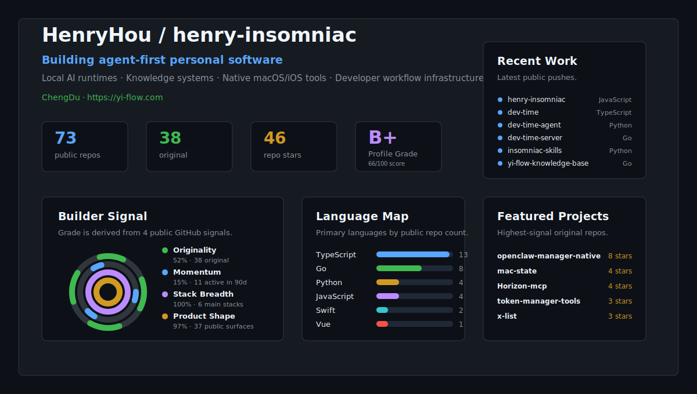

  

# HenryHou / henry-insomniac

I build agent-first personal software: local AI runtimes, knowledge systems, native macOS/iOS tools, and developer workflow infrastructure.

我在构建一个围绕 Agent、知识库、原生工具和工程协作流的个人软件生态。

- Website: https://yi-flow.com
- Location: Chengdu, China
- Focus: Agent Runtime · Knowledge Systems · Native Tools · Dev Workflow

## Featured Work

- `openclaw-manager-native` - native management desktop app for OpenClaw on macOS.
- `insomniac-skills` - agent collaboration scaffolding for project context, rules, and reusable skills.
- `yi-flow-knowledge-base` - knowledge-pack service and publishing surface.
- `project-dashboard-ui` / `project-dashboard-server` - project dashboard frontend and backend.
- `agent-service` - runtime service for a local personal agent platform.
